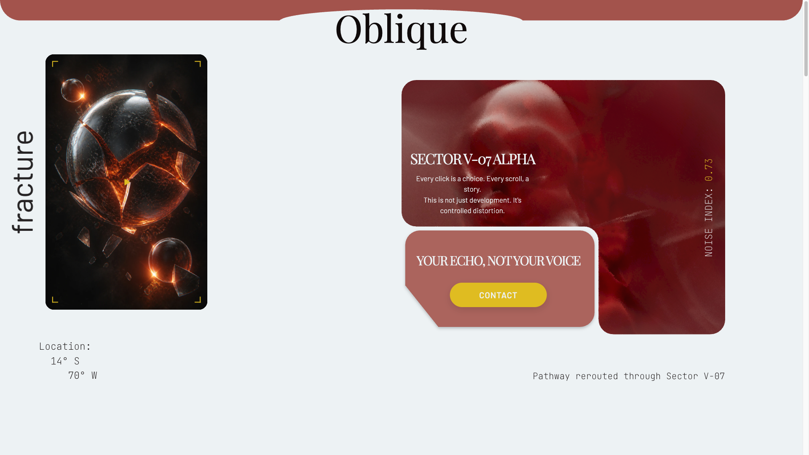
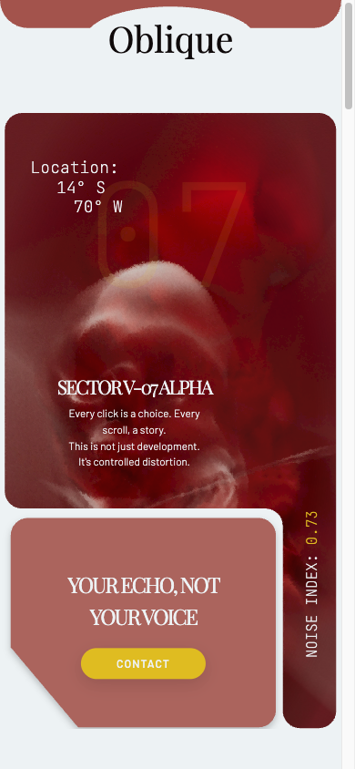

# Oblique ◒

> **An experimental motion experience where interaction becomes part of the story.**

Oblique is a creative front-end project exploring **controlled distortion**, visual storytelling and cinematic motion on the web.

Built as a fragmented sci-fi interface, it combines editorial typography, custom SVG compositions, atmospheric visuals and GSAP-driven interactions. Every scroll, click and transition is designed to feel deliberate.



## ✦ Experience

- **Interactive Fracture** — change the hero visual through a glitch-driven interaction.
- **Motion-first storytelling** — a preloader, page reveal, smooth scrolling and scroll-triggered animations.
- **Archive_01** — an interactive image archive with animated details and a mobile carousel.
- **Anomaly Field** — layered parallax composition with depth and ambient movement.
- **Responsive by design** — distinct desktop and mobile layouts, tailored to their screens.
- **Custom cursor** — interface feedback that reacts to interactive elements.

## 🛠 Built with

| Tool | Purpose |
| --- | --- |
| HTML | Page structure |
| SCSS | Styling, layout and responsive design |
| JavaScript | Interaction logic |
| [GSAP](https://gsap.com/) | Animation, ScrollTrigger and ScrollSmoother |
| [Vite](https://vite.dev/) | Development and production build tooling |

## 🚀 Run locally

```bash
git clone https://github.com/damodevworks/oblique.git
cd oblique
npm install
npm run dev
```

To create a production build:

```bash
npm run build
```

## 🗂 Project structure

```text
src/
├── scripts/
│   ├── gsap/       # Hero, archive, parallax and cursor interactions
│   └── utils/      # Preloader logic
└── styles/
    ├── base/       # Reset and typography
    ├── components/ # Buttons and cursor
    └── layout/     # Hero, archive, parallax and video sections

assets/             # Images, video and SVG assets
public/             # Static assets
```

## 🧠 Concept

**Every click is a choice. Every scroll, a story.**

Oblique is not meant to be a conventional website. It is a visual experiment: an interface built around fragments, signal loss, recovered memory and controlled distortion.

## 📱 Responsive interface

The experience has dedicated compositions for desktop and mobile, including a mobile-first archive carousel and optimized motion behaviour.



## 👤 Author

Designed and developed by **Damian**.

[GitHub ↗](https://github.com/damodevworks) · [Contact ↗](mailto:damian.wiewior98@gmail.com)

## License

All rights reserved. The source code and design may not be copied, modified, or redistributed without prior written permission.

---

`SIGNAL STATUS: ACTIVE` ◉
